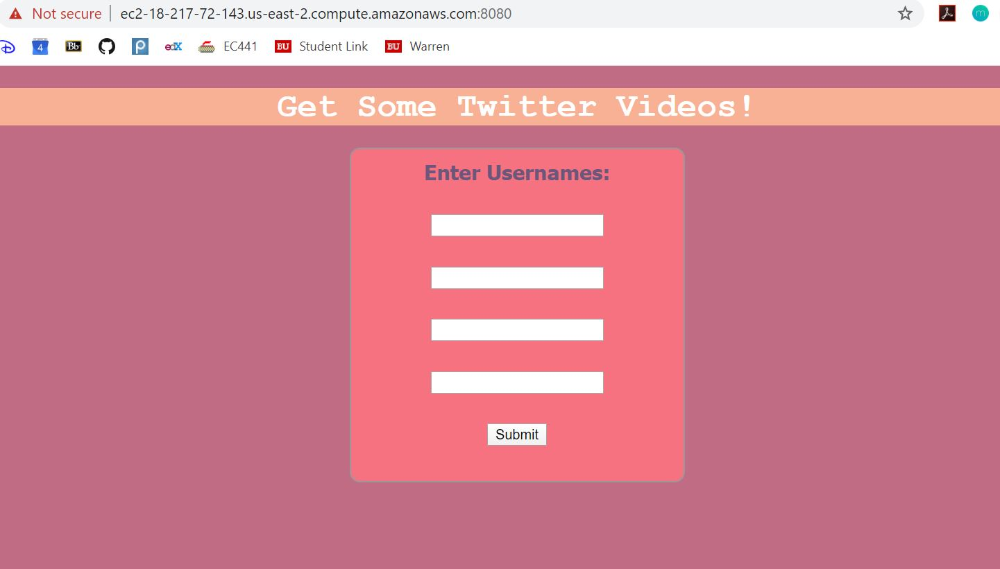
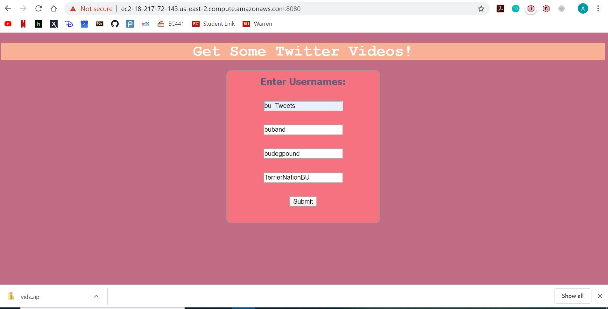
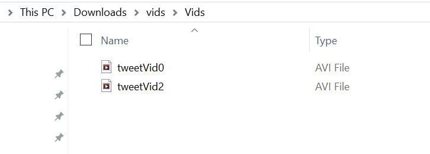

# EC500 C1 Alex Fatyga
Using the previous assignment, I added a flask module to go on top of the multiprocessing of creating a video of tweets and images. I then was able to use AWS and deploy this web app so all users can view it and it is no longer on local host. Users can simply input up to 4 usernames and the videos of these users will be downloaded as a zip file for them. I arbitrarily decided to have them input up to 4 usernames and users can keep downloading as many zip files as they want without refreshing or exiting and reentering the web page.    
I had a great deal of difficulty with AWS and understanding how to actually have the web app on the cloud working properly. For example, I was able to deploy the web app using the AWS EB console but I couldn't put in any sudo commands and modify files as easily - I eventually had to terminate these web apps because I couldn't download ffmpeg for linux properly. Many of the tutorials online are not the most straighforward and I ended up doing a lot of extra work and trying many different things before I found something that actually worked.  
After going to office hours, Stefan directed me to the AWS Instances page and told me to ssh into my instance so I can download ffmpeg for Linux correctly. After I properly added in my videos, he showed me how to change security groups and input/output ports to actually view the website.  
The proper way to have my web app viewable on the cloud is to go onto the instance console, restart the instance I have now (which is now stopped so I don't get charged) and then ssh into my instance and run my file application.py (python3 application.py). I then can go onto the website on port 8080!!

# How Does my Flask Module Work?
By running python3 application.py, my flask module is viewable and can now run my homework 4 code! A user is shown to main.html and can input 4 usernames. After hitting submit, my code makes sure to delete previous images and videos (so the new run does not intersect with the previous). Hitting the submit button triggers a POST so I am then able to read in the usernames and can then run my multiprocessing script with the up to 4 usernames. I then check the folder with the videos, zip them and download them for the user. I make sure that the page is reusable so the user can just keep downloading videos with doing anything besides changing usernames at their ease.

# To Use
After asking me for the link, go to the link on port 8080 and you can enter up to 4 usernames at a time!

# Example Use
The following image is the view of the web page with no inputs!  
    
The following image shows the aftermath of putting in 4 usernames, a zip file is downloaded so the user then has all the videos that were generated   
    
The following shows that within this folder, only 2 videos exist because 2 usernames did not have any tweets to generate videos.  
  

# Assignment
Make your HW4 a REST service running on AWS
- Use Flask as your WEB service platform => Done
- Step 2:  Integrate your module to become a RESTFUL system => DOne
- Deploy your system to free AWS services => Done
- Develop simple WEB applications to test your system. => Done
- Document your REST APIs on your Github => Done
- Keep your server off until we request it for grading.  We dont want you to waste money.

